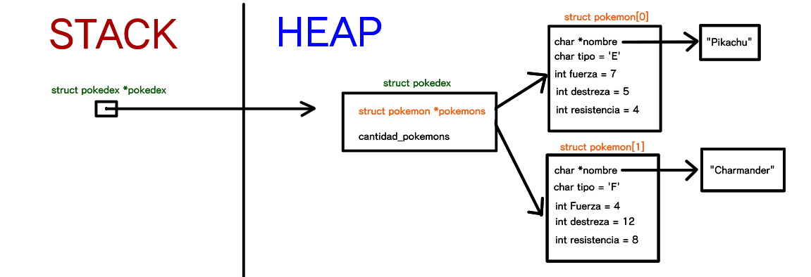

<div align="right">

</div>

# TP1

## Alumno: (Paul Mena) - (110893) - (pmena@fi.uba.ar)

- Para compilar:

```bash
gcc tp1.c src/pokedex.c src/csv.c -o tp1 -ggdb -O0 -std=c99 -Wall -Wconversion -Wtype-limits -Werror -I src
```

- Para ejecutar:

```bash
./tp1
```

- Para ejecutar con valgrind:
```bash
valgrind --leak-check=full --track-origins=yes --show-reachable=yes --error-exitcode=2 ./tp1 2>&1
```

---

##  Funcionamiento

Funcionamiento General
El programa recibe un archivo .csv con informacion de los pokemon a procesar.
Se abre el archivo en modo lectura en una estructura arhivo_csv.
Se inicializa una pokedex 

Funciones y procedimientos

Pokedex.c

* pokedex_crear: Asigna memoria para struct pokedex con malloc e inicializa sus campos; la memoria para el vector de pokemons es dinamica y depende la cantidad de los mismos, inicia en 0 bytes.
Todas las operaciones de la función son O(1) => pokedex_crear es O(1).

* pokedex_cantidad_pokemones: Complejidad O(1).
  
* pokedex_buscar_pokemon: Mediante strcmp(), compara el nombre ingresado con el de cada pokemon.
La funcion es O(n*m), ya que tiene un ciclo for(O(n) en el peor de los casos), strcmp(O(m) en el peor de los casos) y uno esta dentro del otro. 

*  pokedex_agregar_pokemon: Por cada pokemon que se agrega, reasgina memoria al vector pokemons de pokedex mediante un realloc aplicado a un vector de pokemons auxiliar, que de apuntar a una direcciòn valida, se le asigna esa dirección al vector pokemons. Finalmente, se copia los datos del pokemon agregado, en la ultima posicion del vector pokemons.
  La funcion es O(n+m), ya que contiene realloc(O(n)) y strlen(O(n)).

*  pokedex_iterar: La funcion es O(n*2) debido al ordenamiento de pokemons que tiene.
  
*  pokedex_destruir: Su complejidad es O(n) debido a que el ciclo iterará todos los pokemons de pokedex.

    Diagrama de struct pokedex *pokedex:
<div align="center">

</div>

Csv.c

*  abrir_archivo_csv: Su complejidad es O(1), ya que tanto el malloc usado, como la apertura de archivos, tienen esta complejidad.

*  extraer_columna: A partir de una linea de texto, extrae cada columna delimitada por un separador, usa el parametro *inicio, para que luego de extraer cada columna, guarda en inicio la posicion desde la que se va a procesar la siguiente columna.
Su complejidad es O(n), ya que el primer bucle solo recorre la linea hasta un valor de corte, y el segundo bucle solo copia los valores validos en la columna a retornar. 
  
*  leer_linea_csv: Aplica, a cada columna, cada funcion recibida con su contexto; y libera la memoria ocupada por la columna, luego de aplicarle la funcion correspondiente.
Su complejidad computacional es O(n*m), ya que extraer_columna es O(n) y se encuentra dentro de un bucle que iterará en cuanto columnas haya O(m). 
*  cerrar_archivo_csv: Su complejidad es O(1), ya que todas sus operaciones lo son.

  Diagrama de struct archivo_csv *archivo
<div align="center">

</div>


Explicación de cómo funcionan las estructuras desarrolladas en el TP y el funcionamiento general del mismo.

Aclarar en esta parte todas las decisiones que se tomaron al realizar el TP, cosas que no se aclaren en el enunciado, fragmentos de código que necesiten explicación extra, etc.

Incluír **EN TODOS LOS TPS** los diagramas relevantes al problema (mayormente diagramas de memoria para explicar las estructuras, pero se pueden utilizar otros diagramas si es necesario).

### Por ejemplo:

El programa funciona abriendo el archivo pasado como parámetro y leyendolo línea por línea. Por cada línea crea un registro e intenta agregarlo al vector. La función de lectura intenta leer todo el archivo o hasta encontrar el primer error. Devuelve un vector con todos los registros creados.

<div align="center">

</div>

En el archivo `sarasa.c` la función `funcion1` utiliza `realloc` para agrandar la zona de memoria utilizada para conquistar el mundo. El resultado de `realloc` lo guardo en una variable auxiliar para no perder el puntero original en caso de error:

```c
int *vector = realloc(vector_original, (n+1)*sizeof(int));

if(vector == NULL)
    return -1;
vector_original = vector;
```


<div align="center">

</div>

---

## Respuestas a las preguntas teóricas
Incluír acá las respuestas a las preguntas del enunciado (si aplica).
